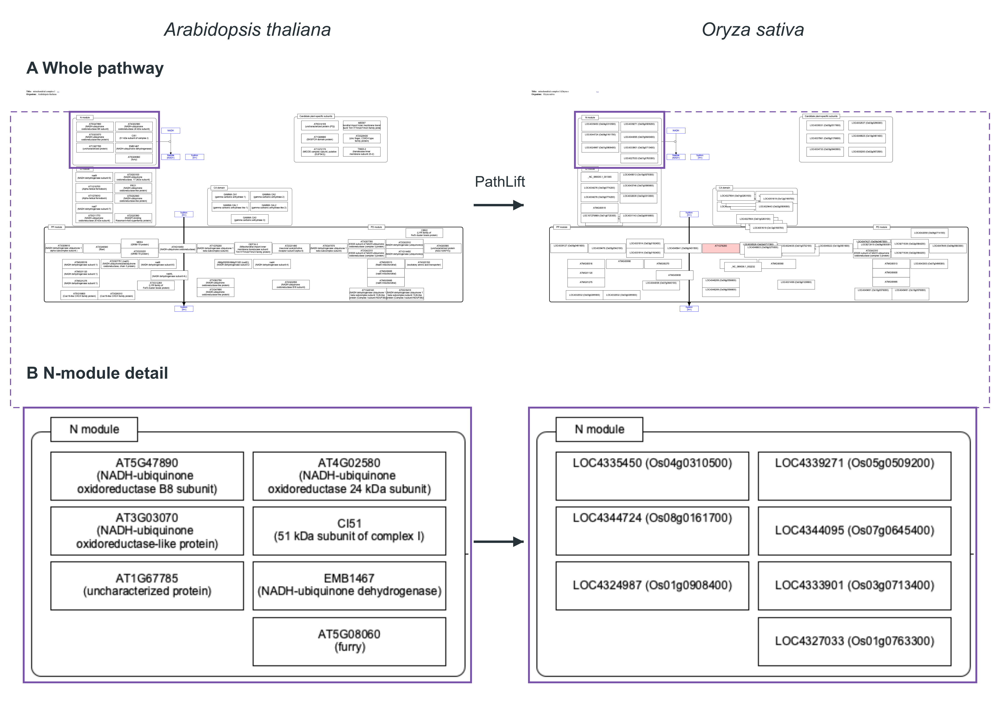
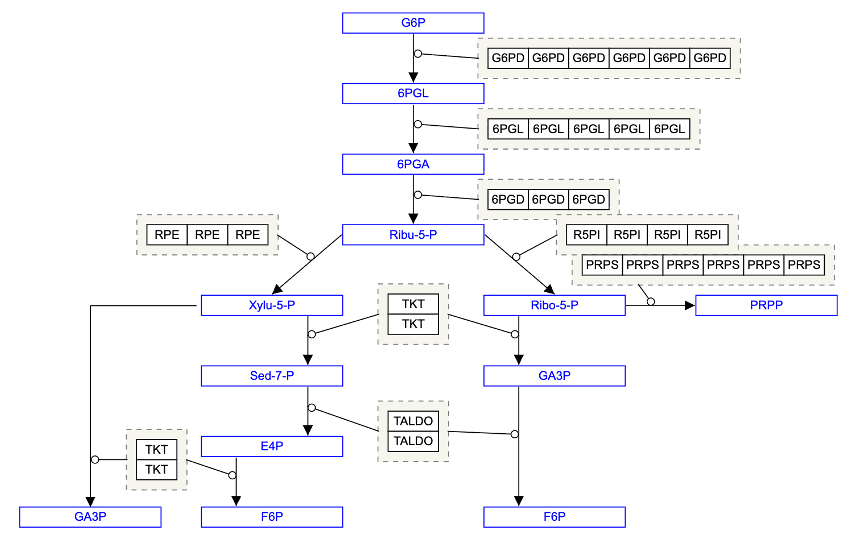

# Introduction

As part of the DBCLS BioHackathon 2026, we here report the development of pathway analysis environment called Quest for Pathways with eXpression (QPX) designed for non-model organisms.

# Results and Discussion

Following BH23 [@BH23rep] and BH25 [@BH25rep], discussions continued at BH26 with the aim of enhancing the usability of QPX. 
At BH26, together with three new members from Hiroshima University (two undergraduate students and one postdoctoral researcher), we worked on the following points toward the development of pathway data for non-model organisms.

## PathLift in use

PathLift is a command line interface (CLI) tool that ‘lifts’ pathways in Graphical Pathway Markup Language (GPML) from WikiPathways by mapping them to gene IDs in other species, using an ortholog mapping table. 
It outputs a GPML file in which the GeneProduct nodes from the source species (e.g. human) have been replaced and expanded to candidate gene nodes for the target species.
Create new pathways for non-model organisms with public DB ID annotations

Following domestic BioHackathon in Japan (BH26.6), we conducted several projects to generate pathway data for non-model organisms using PathLift.

As an example of cross-species pathway reuse, we used PathLift to map an *Arabidopsis thaliana* mitochondrial complex I pathway to *Oryza sativa* gene candidates (Fig. 1). The resulting GPML retains the pathway layout while displaying the corresponding rice gene IDs.

**Figure 1. Arabidopsis-to-rice pathway liftover using PathLift.** **(A)** Whole-pathway views before (left) and after (right) mapping to rice gene candidates. **(B)** The boxed N-module regions are enlarged to show the gene-label changes.

## QPX in Practice 

We created several annotated pathway diagrams and used them for biological pathway analysis (Table 1).
  
Table 1: Newly created use cases in BH26

| Pathway | Species |  Note |
| -------- | --------  | -------- |
| Glycolysis and gluconeogenesis (`WP534`) | *Homo sapiens* | Integration of (meta-analysis of) transcriptomes and proteome data  |
| Pentose phosphate, etc | *Symplocarpus renifolius* | Integration of metabolome and transcriptome data |
| Food Allergy–Associated Mast Cell Activation Pathway |  *Homo sapiens* | |
| Mitochondrial complex I | *Arabidopsis thaliana*    *Oryza sativa* | |
| Photosynthetic carbon reduction (`WP1461`) | *Arabidopsis thaliana* | |

### Integration of transcriptomes and proteome data

Use case for the integration of multiple omics data was investigated.
Differentially abundant proteins (DAPs) in hypoxic stress from proteome and Meta-analysis of public transcriptomes and hypoxic stress were extracted from manuscripts below.

1. Meta-analysis of public transcriptomes: hypoxic stress RNA-seq data (HN-score) collected in "Multi-Omic Meta-Analysis of Transcriptomes and the Bibliome Uncovers Novel Hypoxia-Inducible Genes [@ono_2021].
2. Proteome: differentially abundant proteins (DAPs) flags in "Proteomic-Based Analysis of Hypoxia- and Physioxia-Responsive Proteins and Pathways in Diffuse Large B-Cell Lymphoma [@dus-szachniewicz_proteomic-based_2021].

### Integration of transcriptome and metabolome data

As a use case of QPX for a non-model organism, we prepared pathway maps together with gene expression and metabolome data of the thermogenic spadix of Asian skunk cabbage (*Symplocarpus renifolius*) [@Tanimoto2024]. Three pathways related to nucleotide metabolism were drawn manually in PathVisio 3.3.0 [@PathVisio], using Supplemental Figure S10A–C of Tanimoto et al. (2024) as references: the pentose phosphate pathway, pyrimidine biosynthesis, and purine and histidine biosynthesis (Table 2). Because no gene identifier system is established for this species, gene nodes were annotated with Arabidopsis thaliana gene IDs (AGI codes, Araport11 [@Cheng2017]) and metabolite nodes with ChEBI IDs [@Hastings2016].

Table 2: Pathway maps of *S. renifolius* created in BH26

| Map | Pathway | Gene nodes linked to the table | Metabolite nodes linked to the table |
|---|---|---|---|
| FigS10A | Pentose phosphate pathway | 19 / 33 | 4 / 13 |
| FigS10B | Pyrimidine biosynthesis | 7 / 7 | 2 / 8 |
| FigS10C | Purine and histidine biosynthesis | 13 / 19 | 1 / 15 |

The expression tables were built from the supplementary data of the same study. For the transcriptome (15,904 transcripts, TPM), an AGI code was given to each transcript from the best BLAST hit against Araport11 proteins; 11,438 transcripts received an AGI code. For the metabolome (93 compounds), ChEBI IDs were assigned by hand to all compounds, choosing the ID used in the reaction annotations of UniProt (Rhea) ([@Bansal2022]; [@UniProt2025]), because conversion from compound names or other IDs did not give a unique ChEBI ID. Only the samples of the thermogenic stage (Hot, florets and pith, four replicates each) were used.

To make QPX link map nodes to table rows, the maps and tables had to follow several rules that we found by reading the QPX source code: the table needs an `xref_id` column; the start of the numeric columns is given by a 0-based index (`expression_columns_index`); IDs are matched exactly, including letter case; and curved connectors are not drawn, while straight and elbow lines are. We therefore changed AGI codes to upper case, used the `CHEBI:` prefix for all ChEBI IDs as in WikiPathways and PathVisio, and redrew the curved edges of one map as straight lines. With these settings, clicking a node on a map filtered the heatmaps of both the transcriptome and the metabolome to that gene or compound (Figure 3). We also found that the Python side of QPX reads `xref_id` as an integer, so that string IDs such as AGI codes become null in `selected_expression_data`, although map display and heatmap filtering are not affected. This was reported to the developers.

The maps, tables and a notebook for display were published in the QPX data repository (https://github.com/dogrunjp/qpx-data-pub, `data/Symplocarpus_renifolius`), together with a record of the source of each file and every change made to it, so that the display can be reproduced with a fixed version of QPX (commit `83d27bf`).

This work was carried out with an LLM coding agent (Claude Code, Anthropic). The agent was used to read the QPX source code, to review the hand-drawn maps against the source data, which found three wrong or missing ChEBI IDs, to write scripts for table conversion, and to draft documentation. All decisions on the data were made by the contributor.

**Figure 2. Pentose phosphate biosynthesis pathway of *S. renifolius* displayed in QPX.**

## Future work

A new methodology for constructing compound-centered functional networks was investigated by extracting relational data from PubChem Co-occurrence and enriching edge semantics with PubTator3 annotations.

We will make the assignment of ChEBI IDs reproducible. A tool that lists candidate IDs of the same compound (conjugate acids/bases and tautomers) and ranks them by their use in Rhea reactions is under development, leaving the final choice to the curator. We will also work toward automating the digitization of pathway figures into GPML, and toward handling string identifiers such as AGI codes on the Python side of QPX.

## Acknowledgements

We thank Dr. Egon Willighagen for the continuous support in curating pathways created and inclusion to WikiPathways. 
We also thank Dr. Evan Bolton for pointing the useful resource in PubChem.
We deeply thank organizers of BH26 at Matsuyama (13-19 September 2026) for giving us a chance to refine the QPX system.

# References

